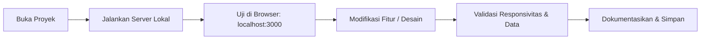

# Alur Kerja & Standar Operasional (Workflow SOP)

Dokumen ini memuat standar alur kerja pengembangan, siklus pengujian, dan tata cara kolaborasi antara pengembang manusia dan Agen AI Antigravity.

---

## 1. Alur Kerja Pengembangan Lokal (Local Dev Loop)



### Langkah Cepat Menjalankan Server:
1. Masuk ke direktori aplikasi:
   ```bash
   cd "dinasti music"
   ```
2. Jalankan perintah:
   ```bash
   npm start
   ```
3. Buka peramban di [http://localhost:3000](http://localhost:3000).

---

## 2. Kolaborasi dengan Agen AI (Pair Programming)

Workspace ini telah dilengkapi dengan 13 skill desain visual dan instrumen developer tools (MCP). Saat meminta AI melakukan perubahan kode:

1. **Gunakan Konsep Spesifik**:
   - Jika ingin mengubah tampilan menjadi lebih editorial atau minimalis: sebutkan *"Gunakan pedoman minimalist-skill"*.
   - Jika ingin merevisi landing page: sebutkan *"Terapkan taste-skill"* untuk menghindari desain generik.
   - Jika ingin tampilan telemetri data inventaris yang tegas: sebutkan *"Gunakan brutalist-skill"*.
2. **Prinsip Perubahan Bertahap**:
   - AI dilarang menghapus fungsi yang sudah berjalan tanpa persetujuan eksplisit.
   - Setiap modifikasi pada UI harus menjaga konsistensi variabel tema warna (`maroon`, `gold`, `cream`, `dark`).

---

## 3. Checklist Pra-Rilis & Kontrol Kualitas (Pre-Flight QA)

Sebelum mempublikasikan versi baru, periksa hal-hal berikut:

- [ ] **Data Persistence**: Uji tambah produk baru, lakukan refresh halaman, dan pastikan data produk tidak hilang.
- [ ] **Kasir & Stok**: Lakukan checkout produk di modul POS kasir, pastikan stok produk pada inventaris berkurang sesuai kuantitas pembelian.
- [ ] **Struk Transaksi**: Pastikan struk digital memunculkan nomor transaksi, tanggal, rincian produk, dan total kalkulasi yang benar.
- [ ] **Responsivitas**: Periksa tampilan pada mode desktop dan simulasi smartphone (lebar 375px–420px) melalui Developer Tools.
- [ ] **Bebas Error Konsol**: Buka tab *Console* di DevTools dan pastikan tidak ada pesan kesalahan JavaScript merah.

---

## 4. Opsi Deployment (Penerbitan Web)

Aplikasi Dinasti Musik bersifat ringan dan fleksibel untuk dideploy:
- **Opsi 1: Static Hosting (Vercel, Netlify, GitHub Pages)**:
  - Cukup upload file `index.html` dan aset terkait.
- **Opsi 2: Node.js VPS / Render / Railway**:
  - Gunakan `server.js` bawaan dengan menjalankan `npm start`. Port otomatis membaca `process.env.PORT`.
